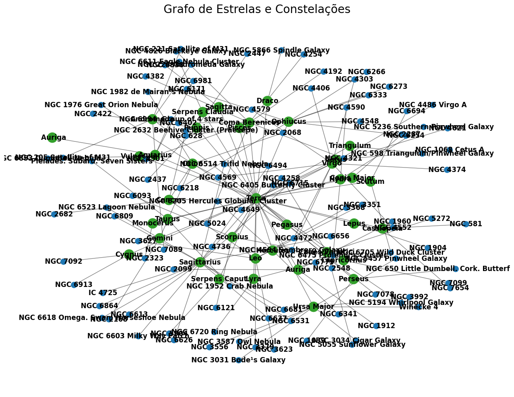
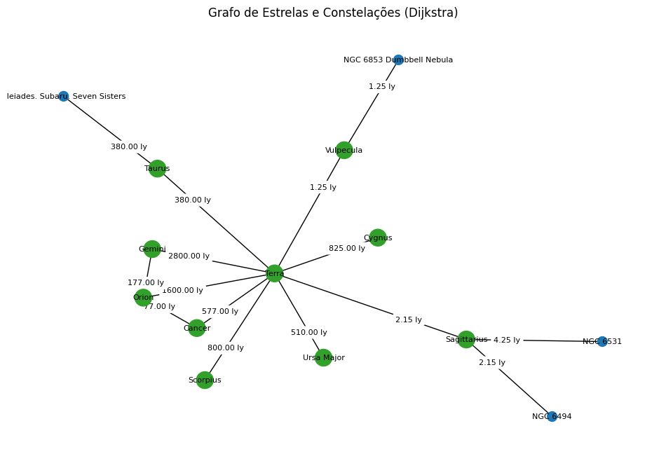
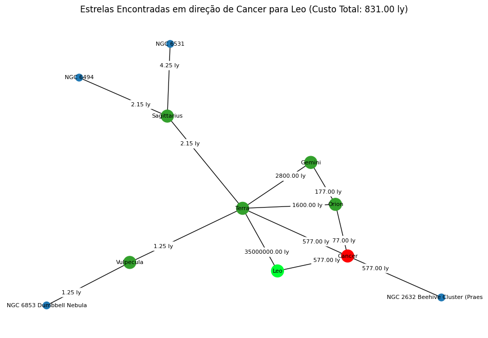
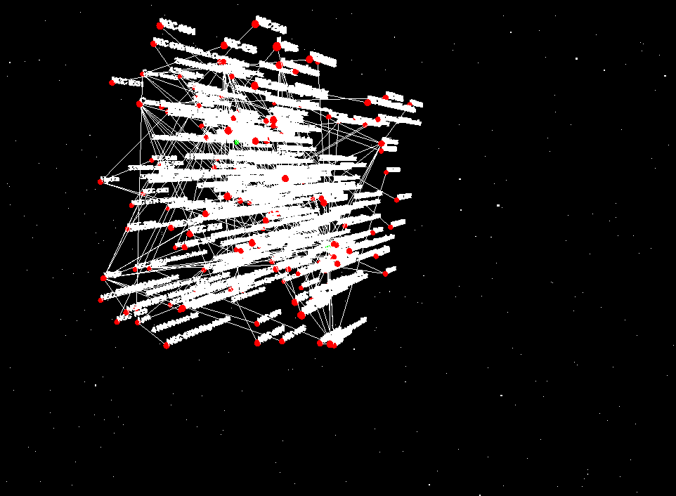
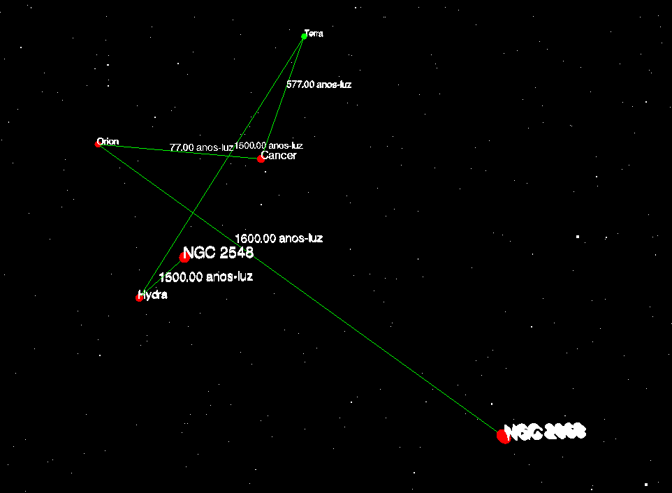
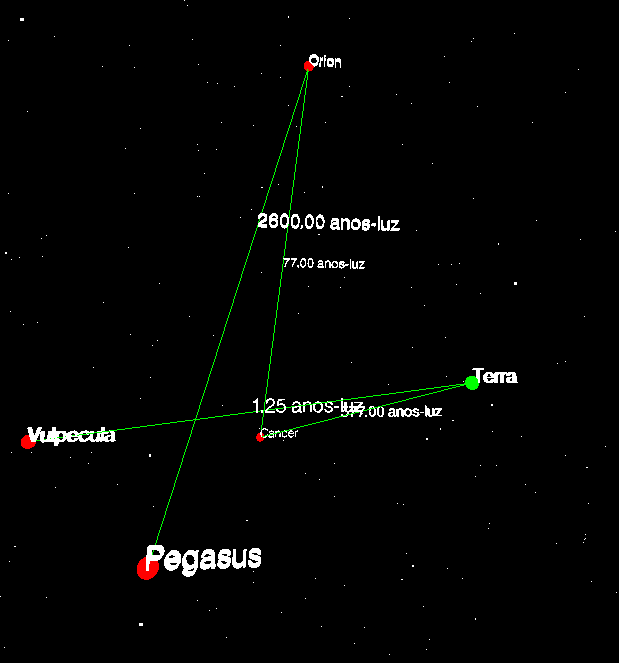

# Temas:
 - Grafos2
 
## Grafos Estrelas do Céu

**Número da Lista**: 2<br>
**Conteúdo da Disciplina**: Grafos 2<br>

## Alunos
| Matrícula | Aluno                            |
| ---       | ---                              |
| 19/0048760 | Wellington Jonathan de Souza Rodrigues |
| 20/2063346  | José Filipi Brito Souza |

## Sobre
O objetivo do código é criar um grafo que representa as conexões entre as estrelas e a Terra, considerando sua magnitude e sua distância em anos-luz da Terra. O grafo tem como fonte com alterações para melhor visualização e compreensão das conexões. Os principais objetivos do código são:

- Carregar um conjunto de dados que contém informações sobre estrelas e suas associações com constelações.
- Representar cada estrela como um nó no grafo, e a associação com sua constelação como uma aresta.
- Utilizar o algoritmo de Dijkstra para calcular quais estrelas podem ser encontradas quando informada uma distância máxima da Terra.
- Utilizar o algoritmo de Prim para gerar a árvore geradora mínima e calcular o custo total em anos-luz para passar por todas as estrelas da árvore referente ao grafo informado.

Além disso, o projeto também possui uma interface de interação 3D, onde é possível visualizar o grafo em um navegador com suporte a JS e interagir com manipulações dos nós, que representam corpos celestes. Selecionando dois nós é possível visualizar quando o menor caminho em anos-luz através do algoritmo de Dijkstra.
## Screenshots

## grafo 01


  
## grafo 02


## grafo 03


## Modelagem 3D


  
## Exemplo de Dijkstra 1


## Exemplo de Dijkstra 2



## Instalação
**Linguagem**: Python 3.x
**Framework**: Jupyter Notebook & Flask 

### Pré-requisitos
Certifique-se de ter as seguintes ferramentas e bibliotecas instaladas:

- Python 3.x (https://www.python.org/downloads/)
- NetworkX (biblioteca para criar e manipular grafos)
- Matplotlib (biblioteca para plotar o grafo)


# Criação de um Grafo distancia das estrelas

Este guia descreve como usar o código Python para  visualizar o grafo de distancia das estrelas para Terra..

## Pré-requisitos

Certifique-se de ter as seguintes ferramentas e bibliotecas instaladas:

- Python 3.x (https://www.python.org/downloads/)
- NetworkX (biblioteca para criar e manipular grafos): 
- Matplotlib (biblioteca para plotar o grafo): 
- Flask (Framework de backend em python para utilização da API)

```
pip install pandas
pip install networkx
pip install matplotlib
pip install flask

```

## Configuração

## Utilização do Jupyter
1. Abra o arquivo "Grafo2_distancia_estrelar.ipynb" no Jupyter Notebook ou no Vscode .
2. Execute as células de código conforme necessário para carregar e analisar os dados estelares, aplicar os algoritmos  e Prim e visualizar o grafo gerado.
3. Certifique-se de fornecer os parâmetros de entrada relevantes, como a distância máxima da Terra e o vértice de origem.

## Utilização da visualização 3D
1. Utilize o comando 'python3 app.py'
2. Vá para o endpoint indicado no terminal, por exemplo: ' * Running on http://127.0.0.1:5000 '
3. Selecione dois nós do grafo
4. Caso queira visualizar o detalhe de cada nó, utilize o console pressionando a tecla 'F12'
5. Para iniciar uma nova busca, pressione a tecla 'ESC' e o grafo será reiniciado

## Exemplo
Aqui está um exemplo de como utilizar o código para criar e visualizar o grafo estelar:

```python
# Importe as bibliotecas necessárias e carregue os dados estelares.
import networkx as nx
import matplotlib.pyplot as plt


...

# Defina a distância máxima desejada e o vértice de origem.
max_distance = 100  # Distância máxima da Terra (em anos-luz)
source_vertex = 'Terra'  # Vértice de origem

#para Algoritmo de Prim  informe Destino.
# Solicitar o vértice de destino desejado
destination_vertex = 'Leo'

...


```

## Vídeo explicando o projeto

<iframe width="560" height="315" src="https://www.youtube.com/embed/Gj0pI7Yvr_o?si=y7sAE0LvY9sfk4cq" title="YouTube video player" frameborder="0" allow="accelerometer; autoplay; clipboard-write; encrypted-media; gyroscope; picture-in-picture; web-share" referrerpolicy="strict-origin-when-cross-origin" allowfullscreen></iframe>

